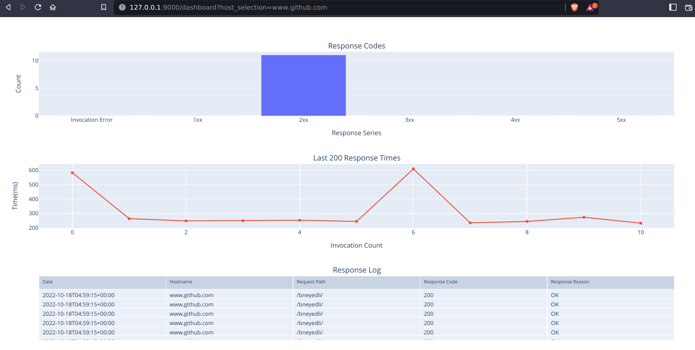

# Hostpoller
Simple python service to poll a given host and path, record results in a sqlite database, serve an endpoint with flask and process results with plotly

# Minimum Requirements
* Docker
* Developed with python [poetry](https://python-poetry.org/), [plotly](https://plotly.com), [flask](https://palletsprojects.com/p/flask/), [sqlalchemy](https://sqlalchemy.org), [pre-commit](https://pre-commit.com) and local [hooks](https://github.com/bneyedli/pre-commit-hook)

## Dockerless requirements
* make
* pip
```
make deps
```

## Usage -- standalone
```
 ./src/hostpoller/poller.py --help                                                                                                                                                                                                                                                                             ✔  0.79 L  2s ─╯
usage: poller.py [-h] [--target TARGET] [--monitor-period MONITOR_PERIOD] [--polling-frequency POLLING_FREQUENCY] [--request-timeout REQUEST_TIMEOUT] [--listen-ip LISTEN_IP] [--listen-port LISTEN_PORT] [--sql-engine SQL_ENGINE] [--sql-db-path SQL_DB_PATH]

Monitor host and store results.

options:
  -h, --help            show this help message and exit
  --target TARGET       Host or ip to target and path, default: https://127.0.0.1/
  --monitor-period MONITOR_PERIOD
                        Time in seconds to monitor given host, default: 10
  --polling-frequency POLLING_FREQUENCY
                        Time in seconds to poll given host over specified period, default: 1
  --request-timeout REQUEST_TIMEOUT
                        Timeout for requests to target, default: 10
  --listen-ip LISTEN_IP
                        Web listener binding ip, default: 127.0.0.1
  --listen-port LISTEN_PORT
                        Web listener binding port, default: 9000
  --sql-engine SQL_ENGINE
                        SQL Engine, default: sqlite
  --sql-db-path SQL_DB_PATH
                        SQL Engine, default: hostpoller.db
```
Example: Query https://www.github.com/
```
./src/hostpoller/poller.py --target https://www.github.com/ --polling-frequency .5 --request-timeout 5 
```

## Usage -- Docker
Build and run container all in one
```
make build run TARGET=https://www.github.com/
```
Run existing container
```
make run TARGET=https://www.github.com/
```

## Frontend

